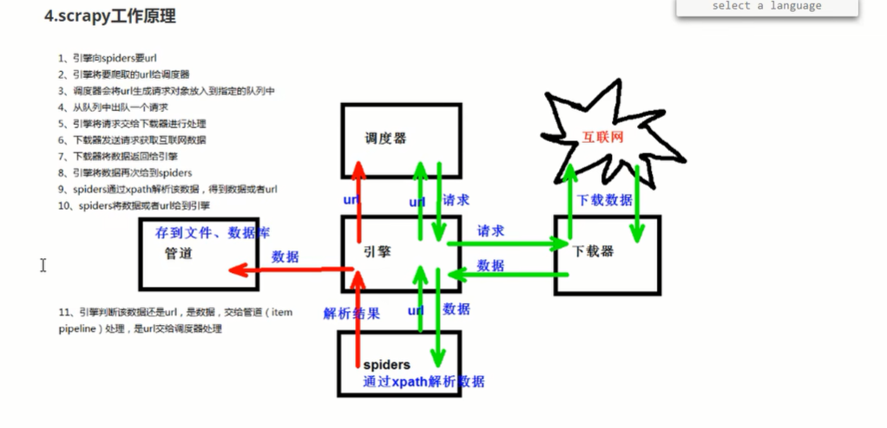
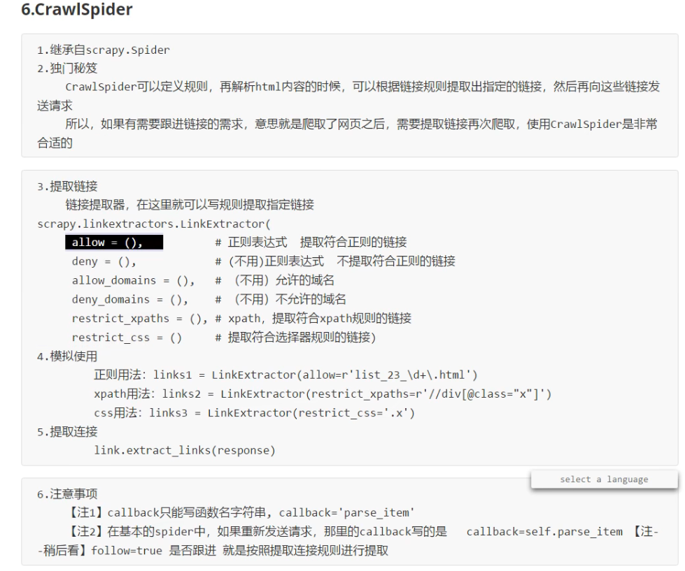
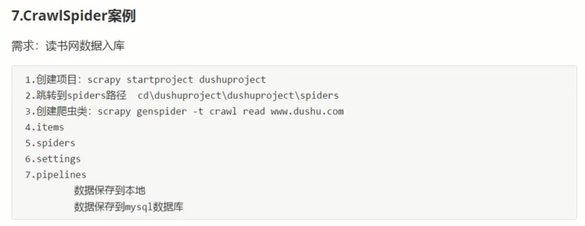
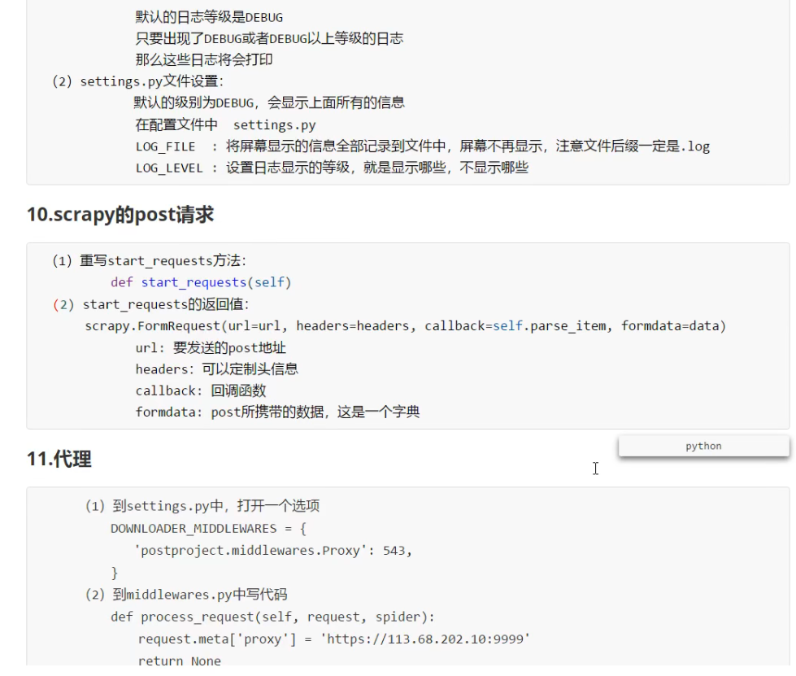

# Python 学习
## Python 安装扩展库
numpy scipy matplotlib seaborn lxml bs4 selenium requests scrapy ipython pymysql jieba Scikit-learn tensorflow
## Python 安装命令
pip install numpy scipy matplotlib -i https://pypi.tuna.tsinghua.edu.cn/simple
## Python 更新命令
python -m pip install -U pycodestyle setuptools -i https://pypi.tuna.tsinghua.edu.cn/simple
## Python 查看多少扩展库
pip list -o
## Python 镜像地址
https://pypi.tuna.tsinghua.edu.cn/simple

---

# scrapy 学习
1. 创建项目命令: scrapy startproject scrapy_baidu_36
    - 注意: 项目的名称必须是英文开头,并且不允许包含汉字  

2. 进入到spiders目录中  

3. 创建爬虫文件命令: scrapy genspider 爬虫的名字 要爬取的网页
    - 注意: 一般情况下不加http协议
    - eg: scrapy genspider baidu www.baidu.com

4. 运行爬虫代码命令: scrapy crawl 爬虫的名字
    - eg: scrapy crawl baidu

## scrapy 项目的结构
- 项目名字
    - 项目名字
        - spiders文件夹(存储的是爬虫文件)
            - init
            - ___自定义的爬虫文件     核心功能文件 (最最重要)___
        - init
        - items           定义数据结构的地方  爬取的数据都包含哪些
        - middleware      中间件  代理等
        - pipelines       管道  用来处理下载的数据
        - settings        配置文件  robots协议  UA定义等

## scrapy 工作原理

## CrawlSpider

## CrawlSpider 案例
- 注意: 创建爬虫文件的命令需要加两个参数: scrapy genspider ___-t crawl___ read https://www.dushu.com/book/1188.html

## scrapy的post请求

